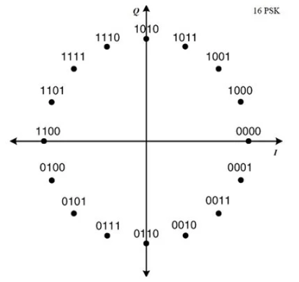

# DVB-S Based End-to-End Digital Communication System

## Introduction

This project implements a complete, RTL-level digital communication system inspired by the DVB (Digital Video Broadcasting) standard, adapted for point-to-point terrestrial backhaul rather than its original satellite broadcast context. The system is designed and verified entirely in Verilog, targeting FPGA implementation, and models a full transmit-to-receive data path: from raw payload input, through encryption and forward error correction, to modulation, transmission over a channel, and back through demodulation, error correction, and decryption to recover the original data.

The design integrates three major subsystems into a single coherent pipeline:

- **AES-128 encryption/decryption** for data confidentiality
- **Reed-Solomon RS(208,192) coding** for forward error correction
- **Hybrid BPSK/16-PSK modulation and demodulation** for the physical-layer transmission

*End-to-end architecture: TX chain (AES → RS → modulator) through the channel to the RX chain (demodulator → RS decoder → AES decryption).*

A key architectural decision made early in the project was modifying the standard DVB RS(204,188) code to RS(208,192), so that the payload size *k* = 192 is evenly divisible by 16 bytes. This allows clean, block-aligned integration with AES-128, which operates on 128-bit (16-byte) blocks — avoiding padding or fragmentation issues at the AES/RS boundary. The processing order was also fixed early as **encrypt-then-encode**: data is encrypted with AES-128 first, and the resulting ciphertext is then protected with Reed-Solomon coding, mirroring standard secure communication practice.

The entire system operates on a single clock domain (`clk_sample`), with a `symbol_tick` signal acting as a clock-enable strobe — one pulse every 4 clock cycles, derived from a 4x upsampler. This single-clock, tick-driven approach simplifies timing closure and avoids the complexity of clock-domain crossing between subsystems, at the cost of requiring careful pulse/enable sequencing throughout the design.

The project was verified using a MATLAB golden-model reference (covering AES, RS, and the 16-PSK symbol mapping) cross-checked against ModelSim RTL simulation, culminating in a full multi-frame end-to-end testbench that validates correct data recovery across the entire TX-to-RX loopback path.

| TX Chain | RX Chain |
|---|---|
|  |  |

## AES-128 Encryption

Data confidentiality is provided by a 128-bit AES implementation operating in the encrypt-then-encode pipeline described above. Each 128-bit (16-byte) plaintext block is encrypted before being handed off to the Reed-Solomon encoder, and the corresponding decryption stage on the receive side runs only after Reed-Solomon decoding has corrected the received codeword.

Key integration points in the design:

- **Block alignment**: The RS(208,192) code was chosen specifically so that the 192-byte payload divides evenly into 16-byte AES blocks, eliminating the need for padding logic between the two stages.
- **TX-side handoff**: On transmit, the AES ciphertext output is passed to the Reed-Solomon encoder through dedicated interface registers as part of the 32-cycle master TX period orchestrated by `dvb_data_master_fsm`.

*The 32-cycle master TX period showing AES → RS → modulator handoff timing.*

- **RX-side handoff**: On receive, the `rs_aes_reg` module accumulates decoded RS output into 128-bit words for AES decryption. Byte ordering between the RS decoder output and the AES word assembly was a notable source of early bugs and was corrected to ensure the decrypted plaintext matches the original input.
- **Valid signaling**: The `aes_valid` signal marking a ready-to-decrypt word was converted from a registered to a combinational signal to correctly align with the timing of the surrounding pipeline stages.

## Encoding: Reed-Solomon RS(208,192)

Forward error correction is provided by a Reed-Solomon code operating over GF(2^8), configured as RS(208,192) — a modification of the standard DVB RS(204,188) code. This gives 16 parity symbols per codeword (208 - 192), capable of correcting up to 8 symbol errors per codeword, while keeping the payload size compatible with AES-128 block boundaries.

On the receive side, decoding presented a significant architectural challenge: the RS decoder has a large processing latency (approximately 222 `symbol_tick` cycles of internal stall) while the demodulator feeds it symbols continuously. This latency mismatch was resolved using a **ping-pong dual-decoder architecture** — two RS decoder instances alternate, so that while one decoder is processing a completed codeword, the other is accepting the next incoming stream of symbols. The `Rx_ctrl_fsm` module centrally manages this alternation, along with latency counting, output windowing, and AES valid pulse generation.

During synthesis, a Xilinx XST crash was traced to excessive loop unrolling inside `gf_inverse`, compounded by nested function calls in `omega_eval` and `lambda_derivative_eval` (part of the Berlekamp-Massey / Chien search error-correction math). This was resolved by replacing the unrolled inversion logic with a precomputed GF(2^8) lookup table and inlining the `gf_mult` logic directly, significantly reducing synthesis complexity.

## Modulation: Hybrid BPSK/16-PSK

The physical layer uses a hybrid modulation scheme combining BPSK and 16-PSK, allowing different parts of the frame (such as preamble/control vs. payload data) to use the modulation format best suited to their purpose — BPSK for robustness on critical synchronization fields, and 16-PSK for higher spectral efficiency on payload data.

Key design elements:

- **Symbol mapping**: The 16-PSK constellation mapping was designed in MATLAB using Q2.14 fixed-point I/Q symbol values, later translated into the Verilog modulator's lookup logic.

*Q2.14 fixed-point 16-PSK constellation as designed in the MATLAB golden model.*

- **Preamble priming**: A dedicated `Dummy` FSM state precedes the Preamble state, transmitting a 40-bit alternating pattern purely to prime the BPSK matched filter before meaningful synchronization data is sent — improving filter settling behavior at the start of each frame.
- **Symbol timing**: Modulation and demodulation are both driven by the shared `symbol_tick` strobe (1 pulse per 4 `clk_sample` cycles), keeping the entire modulation chain synchronized to the same single-clock-domain timing base used throughout the rest of the system.

*The `symbol_tick` strobe — one pulse every 4 `clk_sample` cycles — driving the modulator/demodulator timing base.*

- **Demodulator pipeline**: On receive, nibble-to-byte assembly from demodulated symbols is handled by `demod_rs_reg`, which uses the same ping-pong selection logic that feeds the dual Reed-Solomon decoders, ensuring continuous symbol intake despite RS decoding latency.

Verification of the modulation/demodulation chain included testbench CSV logging of intermediate signals (`preamble_bb`, `I_out`, `Q_out`) to allow direct comparison against the MATLAB golden model's I/Q trajectories.

## Verification Results

*Multi-frame end-to-end testbench output confirming correct data recovery across the full TX-to-RX loopback path.*

## Future Enhancements

Potential areas for extending this work include:

- Symbol timing recovery for asynchronous channel conditions
- Bandpass (RF-band) transmission rather than baseband-equivalent modeling
- Clock-domain crossing (CDC) support for multi-clock-domain deployment
- Extension to OFDM-based modulation for improved spectral efficiency and multipath resilience